# BÁO CÁO THIẾT KẾ & TRIỂN KHAI DỰ ÁN THÀNH VIÊN 1
## Intelligent Enterprise Email Automation & Helpdesk CRM
### Kiến trúc Tinh gọn Chuẩn hóa: 3 Luồng &times; 12 Nodes (Member 1 Edition)

---

## 1. Giới thiệu Tổng quan Vai trò Thành viên 1

Trong hệ sinh thái **Enterprise Email Automation**, **Thành viên 1** đóng vai trò là **"Cửa ngõ tiếp nhận & Trung tâm điều phối vé sự cố" (Core Ingest, AI Triage & Helpdesk SLA Dispatcher)**. 

Dự án này được thiết kế và tách biệt thành một dự án độc lập, chạy độc lập hoàn toàn với:
* **3 Workflow n8n tinh gọn**: Mỗi workflow được chuẩn hóa chính xác **12 nodes/bước**.
* **PostgreSQL 16**: Quản lý danh mục phòng ban, danh sách đen/trắng, nhật ký phân loại và hệ thống vé hỗ trợ.
* **NestJS Core API (Port 4000)**: Backend xử lý phân loại, cấp phát vé và cung cấp API thời gian thực.
* **Next.js 14 App Router (Port 3000)**: Giao diện trực quan cho phép kỹ thuật viên theo dõi hàng đợi mail, duyệt điều phối và xử lý vé.

---

## 2. Chi tiết 3 Luồng Nghiệp vụ (Chuẩn 12 Nodes Mỗi Luồng)

```mermaid
graph LR
    subgraph W1["Luồng 1: Ingest & Anti-Spam (12 Nodes)"]
        W1_N1["Webhook Ingest"] --> W1_N2["Clean Payload"]
        W1_N2 --> W1_IF1{"Check Spam/Bounce"}
        W1_IF1 -->|Hợp lệ| W1_DB1["Check Blacklist"]
        W1_DB1 --> W1_IF2{"Blacklisted?"}
        W1_IF2 -->|Có| W1_QUAR["Quarantine Vault & Alert"]
        W1_IF2 -->|Không| W1_PKG["Package Clean Email"]
        W1_PKG --> W1_CALL["Call Flow 2 HTTP"]
    end

    subgraph W2["Luồng 2: AI Triage & Routing (12 Nodes)"]
        W1_CALL --> W2_N1["Webhook Flow 2"]
        W2_N1 --> W2_AI["AI Semantic Classifier"]
        W2_AI --> W2_SLA["Calc SLA Window"]
        W2_SLA --> W2_DB["Store Triage Log"]
        W2_DB --> W2_ROUTE["Switch Department"]
        W2_ROUTE --> W2_MAIL["Send SLA Confirmation"]
        W2_MAIL --> W2_CALL["Call Flow 3 HTTP"]
    end

    subgraph W3["Luồng 3: Ticket & SLA Dispatcher (12 Nodes)"]
        W2_CALL --> W3_N1["Webhook Flow 3"]
        W3_N1 --> W3_GEN["Gen Code TICK-2026-XXXX"]
        W3_GEN --> W3_LOAD["Query Least-Busy Agent"]
        W3_LOAD --> W3_SAVE["Insert Ticket Master"]
        W3_SAVE --> W3_NOTIF["Email Notify Agent"]
        W3_NOTIF --> W3_ALERT["Push In-App Realtime Alert"]
    end
```



### 2.1. Luồng 1: Ingest, Anti-Spam & Blacklist Quarantine (12 Nodes)
*File workflow:* `workflows/flow01_ingest_antispam.json`
* **Node 1 (1. Email Ingest Webhook)**: Lắng nghe request `POST /webhook/m1-flow1-ingest`.
* **Node 2 (2. Payload Normalization Code)**: Chuẩn hóa header, làm sạch HTML body, tách email sender chuẩn bằng Regex.
* **Node 3 (3. Filter System Bounces Code)**: Phát hiện và gắn cờ các email hệ thống tự sinh (`no-reply`, `mailer-daemon`, `bounce`).
* **Node 4 (4. Check Sender Reputation Postgres)**: Truy vấn điểm tín nhiệm (`reputation_score`) và vi phạm từ bảng `email_senders_reputation`.
* **Node 5 (5. AI Spam & Phishing Classifier Gemini - Agent 9)**: Gọi mô hình Gemini 1.5 Flash phân tích nội dung, phát hiện Spam, Phishing, mã độc và tính điểm tin cậy.
* **Node 6 (6. IF Clean & High Reputation)**: Rẽ nhánh: Nếu `reputation_score >= 20` và `is_spam == false` (Nhánh True), ngược lại (Nhánh False).
* **Node 7 (7. Quarantine Vault Postgres - Nhánh False)**: Lưu trữ email vi phạm vào bảng cách ly an toàn `email_quarantine_vault`.
* **Node 8 (8. Security Alert Mailer - Nhánh False)**: Gửi email cảnh báo an ninh khẩn cấp qua SMTP cho Quản trị viên SOC.
* **Node 9 (9. Update Sender Strike Score Postgres - Nhánh False)**: Tăng số lần vi phạm (`failed_attempts + 1`), hạ điểm tín nhiệm (`reputation_score - 30`).
* **Node 10 (10. Format Clean Verified Payload Code - Nhánh True)**: Đóng gói payload email an toàn, gắn cờ `IS_CLEAN_VERIFIED = true`.
* **Node 11 (11. Audit Ingest Pass Postgres - Nhánh True)**: Ghi log kiểm toán `INBOUND_CLEAN_EMAIL_ACCEPTED` vào bảng `system_audit_logs`.
* **Node 12 (12. Trigger Workflow 2 Sub-workflow - Nhánh True)**: Gọi Webhook nội bộ bàn giao dữ liệu sạch kích hoạt Luồng 2.

---

### 2.2. Luồng 2: AI Multi-Department Triage & Acknowledgment (12 Nodes)
*File workflow:* `workflows/flow02_department_triage.json`
* **Node 1 (1. Sub-Workflow Ingest Trigger)**: Tiếp nhận dữ liệu sạch từ Luồng 1 tại `POST /webhook/m1-flow2-triage`.
* **Node 2 (2. Fetch Department Directory HTTP)**: Gọi API NestJS `GET /api/v1/departments` để lấy danh mục phòng ban hoạt động.
* **Node 3 (3. AI Semantic Classifier Gemini - Agent 1)**: Gọi Gemini 1.5 Flash phân tích ngữ cảnh tiếng Việt: trích xuất phòng ban (Tech/Sales/Finance/General), độ ưu tiên (P1–P4), sắc thái và lý do khẩn cấp.
* **Node 4 (4. Output Schema Guard Code)**: Kiểm định tính hợp lệ của JSON từ AI, ép kiểu an toàn và chuẩn hóa dữ liệu.
* **Node 5 (5. Save Email Triage Log Postgres)**: Lưu toàn bộ kết quả phân loại và điểm tự tin vào bảng `email_triage_logs`.
* **Node 6 (6. Compute Dynamic SLA Window Code)**: Tính toán thời hạn cam kết xử lý linh hoạt (P1: 2h, P2: 4h, P3: 8h, P4: 24h) và soạn mẫu email.
* **Node 7 (7. IF Critical Priority P1)**: Kiểm tra nếu sự cố thuộc diện khẩn cấp P1 (Hệ thống sập, downtime diện rộng).
* **Node 8 (8. Escalate Emergency Alert Email - Nhánh True)**: Gửi email cảnh báo đỏ lập tức tới Ban Chỉ đạo ứng cứu khẩn cấp qua SMTP.
* **Node 9 (9. Send Customer Confirmation Email)**: Gửi email phản hồi tự động cho khách hàng kèm thời hạn cam kết SLA.
* **Node 10 (10. Audit Triage Success Postgres)**: Ghi nhận sự kiện `EMAIL_TRIAGED_SUCCESSFULLY` vào `system_audit_logs`.
* **Node 11 (11. Format Routing Packet Code)**: Đóng gói dữ liệu điều phối theo mã phòng ban (`department_code`).
* **Node 12 (12. Route to Downstream Workflows Code)**: Kích hoạt Luồng 3 (Kỹ thuật); chuẩn bị gói bàn giao cho Luồng 7 (Sales) và Luồng 9 (Finance).

---

### 2.3. Luồng 3: AI-Driven Ticket Generation & SLA Dispatcher (12 Nodes)
*File workflow:* `workflows/flow03_ticket_sla_dispatch.json`
* **Node 1 (1. Receive Tech Intent Trigger)**: Tiếp nhận yêu cầu kỹ thuật từ Luồng 2 tại `POST /webhook/m1-flow3-ticket`.
* **Node 2 (2. AI Ticket Extractor Gemini - Agent 3)**: Gọi Gemini 1.5 Flash bóc tách tiêu đề lỗi, phân loại module bị ảnh hưởng và trích xuất các bước tái hiện (`reproduce_steps`).
* **Node 3 (3. Generate Ticket Code ID Code)**: Sinh mã vé sự cố định dạng chuẩn doanh nghiệp `TK-YYYYMMDD-XXXX`.
* **Node 4 (4. Query Available Agents Postgres)**: Truy vấn bảng `support_agents` lọc các KTV kỹ thuật đang trực (`status = 'AVAILABLE'`).
* **Node 5 (5. Least-Busy Load Balancer Code)**: Thuật toán Least-Busy chọn KTV có số vé đang xử lý ít nhất.
* **Node 6 (6. Create Ticket Master HTTP)**: Gọi NestJS API `POST /api/v1/tickets` tạo vé mới với trạng thái `PENDING`.
* **Node 7 (7. Update Agent Workload Postgres)**: Tăng số lượng vé phụ trách của KTV lên `+1`.
* **Node 8 (8. Initial System Comment HTTP)**: Gọi NestJS API `POST /api/v1/tickets/comments` ghi chú phân tích sự cố ban đầu của AI vào lịch sử vé.
* **Node 9 (9. Notify Support Agent Email)**: Bắn email qua SMTP cho KTV phụ trách kèm mã vé, các bước tái hiện và liên kết trực tiếp trên Next.js.
* **Node 10 (10. Audit SLA Dispatch Postgres)**: Ghi log kiểm toán `TICKET_DISPATCHED_TO_AGENT` vào `system_audit_logs`.
* **Node 11 (11. Format Ticket Packet Code)**: Đóng gói thông tin vé gồm mã vé, chẩn đoán AI, KTV và khách hàng.
* **Node 12 (12. Trigger Luong 4 Sub-Workflow Code)**: Đóng gói bridge payload chuẩn bị sẵn sàng cho Luồng 4 (Thành viên 2 - RAG & Draft Reply) và kết thúc toàn trình.

---

## 3. Cấu trúc Thư mục Dự án

```
email-automation/
├── docker-compose.yml                  # File Docker Compose tại thư mục gốc
├── .env.example                        # Mẫu biến môi trường (bao gồm GEMINI_API_KEY)
├── docker/
│   ├── docker-compose.yml              # File Docker Compose quản lý PostgreSQL 16 & n8n
│   └── .env                            # Biến môi trường cho cụm container Docker
├── database/
│   ├── init.sql                        # Script khởi tạo toàn bộ CSDL Member 1
│   ├── 00_core_schema.sql              # Departments, reputation, quarantine vault, audit logs
│   └── 01_member1_tickets.sql          # Triage logs, support agents, tickets, ticket_comments
├── workflows/                          # 3 Workflow n8n chuẩn (12 Nodes/luồng) để import
│   ├── flow01_ingest_antispam.json     # Luồng 1: Ingest, Anti-Spam & Blacklist Quarantine
│   ├── flow02_department_triage.json   # Luồng 2: AI Multi-Department Triage & Acknowledgment
│   └── flow03_ticket_sla_dispatch.json # Luồng 3: AI Ticket Generation & SLA Dispatcher
├── backend/                            # NestJS Core API (Port 4000)
│   ├── package.json
│   ├── tsconfig.json
│   ├── nest-cli.json
│   └── src/
│       ├── main.ts
│       ├── app.module.ts
│       ├── core/database/
│       └── modules/tickets/
└── frontend/                           # Next.js 14 App Router (Port 3000)
    ├── package.json
    ├── tsconfig.json
    ├── next.config.js
    └── src/
        ├── components/Navbar.tsx
        └── app/
            ├── layout.tsx
            └── tickets/page.tsx        # Dashboard Triage Logs & Tickets
```

---

## 4. Hướng dẫn Cài đặt & Vận hành

### Bước 1: Khởi động Hạ tầng Docker (PostgreSQL & n8n)
```bash
cd /home/kieu-trang/email-automation/docker
docker compose up -d
```
* Kiểm tra PostgreSQL tại cổng `5432`.
* Kiểm tra n8n Web Console tại `http://localhost:5678`.

### Bước 2: Import 3 Workflows vào n8n
1. Mở trình duyệt vào `http://localhost:5678`.
2. Tạo mới một Workflow $\rightarrow$ Bấm menu `...` góc trên bên phải $\rightarrow$ Chọn **Import from File**.
3. Import lần lượt 3 file trong thư mục `workflows/`:
   * `workflows/flow01_ingest_antispam.json`
   * `workflows/flow02_department_triage.json`
   * `workflows/flow03_ticket_sla_dispatch.json`
4. Cấu hình Credentials tài khoản **Postgres** và **SMTP** tương ứng trong n8n.
5. Bật công tắc **Active** (gạt sang ON) cho cả 3 workflows.

### Bước 3: Cài đặt & Khởi chạy Backend NestJS (Cổng 4000)
```bash
cd /home/kieu-trang/email-automation/backend
npm install
npm run start:dev
```
* Backend sẽ lắng nghe tại: `http://localhost:4000`.

### Bước 4: Cài đặt & Khởi chạy Frontend Next.js (Cổng 3000)
```bash
cd /home/kieu-trang/email-automation/frontend
npm install
npm run dev
```
* Truy cập Web UI tại: `http://localhost:3000` (tự động điều hướng vào `/tickets`).

---

## 5. Danh mục API Endpoints Cung cấp

| Phương thức | Đường dẫn API | Chức năng nghiệp vụ |
| :---: | :--- | :--- |
| `GET` | `/api/v1/triage/departments` | Lấy danh mục phòng ban và email phụ trách |
| `GET` | `/api/v1/triage/logs` | Lấy danh sách email đã phân loại (hỗ trợ lọc theo Category/Priority) |
| `PATCH` | `/api/v1/triage/logs/:id/status` | Cập nhật trạng thái duyệt điều phối (`PENDING` $\rightarrow$ `PROCESSED`) |
| `GET` | `/api/v1/triage/stats` | Thống kê số lượng thư đến, số thư P1, số vé đang mở |
| `POST` | `/api/v1/triage/in-app-alert` | Nhận thông báo thời gian thực từ n8n |
| `GET` | `/api/v1/tickets` | Lấy danh sách toàn bộ vé hỗ trợ kỹ thuật và hạn giờ SLA |
| `GET` | `/api/v1/tickets/agents` | Lấy danh sách kỹ thuật viên đang sẵn sàng kèm số vé đang xử lý |
| `POST` | `/api/v1/tickets` | Tạo vé hỗ trợ thủ công từ Web UI |
| `PATCH` | `/api/v1/tickets/:code/resolve` | Đóng vé, ghi nhận hoàn tất SLA và giảm tải công việc cho KTV |

---

*Dự án hoàn toàn độc lập, tinh gọn, tuân thủ nguyên lý thiết kế Micro-workflows và đáp ứng trọn vẹn tiêu chuẩn nghiệm thu đồ án kỹ thuật.*
