# BÁO CÁO THIẾT KẾ & TRIỂN KHAI DỰ ÁN THÀNH VIÊN 1
## Intelligent Enterprise Email Automation & Helpdesk CRM
### Kiến trúc Tinh gọn Chuẩn hóa: 3 Luồng &times; 12 Nodes (Member 1 Edition)

---

## 1. Giới thiệu Tổng quan Vai trò Thành viên 1

Trong hệ sinh thái **Enterprise Email Automation**, **Thành viên 1** đóng vai trò là **"Cửa ngõ tiếp nhận & Trung tâm điều phối vé sự cố" (Core Ingest, AI Triage & Helpdesk SLA Dispatcher)**. 

Dự án này được thiết kế và tách biệt thành một dự án độc lập, chạy độc lập hoàn toàn với:
* **3 Workflow n8n tinh gọn**: Mỗi workflow được chuẩn hóa chính xác **12 nodes/bước**.
* **PostgreSQL 16**: Quản lý danh mục phòng ban, danh sách đen/trắng, nhật ký phân loại và hệ thống vé hỗ trợ.
* **NestJS Core API (Port 4000)**: Backend xử lý phân loại, cấp phát vé và cung cấp API thời gian thực.
* **Next.js 14 App Router (Port 3000)**: Giao diện trực quan cho phép kỹ thuật viên theo dõi hàng đợi mail, duyệt điều phối và xử lý vé.

---

## 2. Chi tiết 3 Luồng Nghiệp vụ (Chuẩn 12 Nodes Mỗi Luồng)

```mermaid
graph LR
    subgraph W1["Luồng 1: Ingest & Anti-Spam (12 Nodes)"]
        W1_N1["Webhook Ingest"] --> W1_N2["Clean Payload"]
        W1_N2 --> W1_IF1{"Check Spam/Bounce"}
        W1_IF1 -->|Hợp lệ| W1_DB1["Check Blacklist"]
        W1_DB1 --> W1_IF2{"Blacklisted?"}
        W1_IF2 -->|Có| W1_QUAR["Quarantine Vault & Alert"]
        W1_IF2 -->|Không| W1_PKG["Package Clean Email"]
        W1_PKG --> W1_CALL["Call Flow 2 HTTP"]
    end

    subgraph W2["Luồng 2: AI Triage & Routing (12 Nodes)"]
        W1_CALL --> W2_N1["Webhook Flow 2"]
        W2_N1 --> W2_AI["AI Semantic Classifier"]
        W2_AI --> W2_SLA["Calc SLA Window"]
        W2_SLA --> W2_DB["Store Triage Log"]
        W2_DB --> W2_ROUTE["Switch Department"]
        W2_ROUTE --> W2_MAIL["Send SLA Confirmation"]
        W2_MAIL --> W2_CALL["Call Flow 3 HTTP"]
    end

    subgraph W3["Luồng 3: Ticket & SLA Dispatcher (12 Nodes)"]
        W2_CALL --> W3_N1["Webhook Flow 3"]
        W3_N1 --> W3_GEN["Gen Code TICK-2026-XXXX"]
        W3_GEN --> W3_LOAD["Query Least-Busy Agent"]
        W3_LOAD --> W3_SAVE["Insert Ticket Master"]
        W3_SAVE --> W3_NOTIF["Email Notify Agent"]
        W3_NOTIF --> W3_ALERT["Push In-App Realtime Alert"]
    end
```



### 2.1. Luồng 1: Ingest, Anti-Spam & Blacklist Quarantine (12 Nodes)
*File workflow:* `workflows/flow01_ingest_antispam.json`
* **Node 1 (1. Email Ingest Webhook)**: Lắng nghe request `POST /webhook/m1-flow1-ingest`.
* **Node 2 (2. Payload Normalization Code)**: Chuẩn hóa header, làm sạch HTML body, tách email sender chuẩn bằng Regex.
* **Node 3 (3. Filter System Bounces IF)**: Loại trừ các email hệ thống (`no-reply`, `mailer-daemon`).
* **Node 4 (4. Check Sender Reputation Postgres)**: Truy vấn kiểm tra danh tính trong bảng `email_senders_reputation`.
* **Node 5 (5. IF Blacklisted Sender)**: Rẽ nhánh phát hiện nếu người gửi thuộc blacklist.
* **Node 6 (6. Quarantine Vault Postgres)**: Lưu thư độc hại vào khu vực cách ly `system_audit_logs`.
* **Node 7 (7. Security Alert Email)**: Gửi email cảnh báo an ninh nội bộ cho quản trị viên.
* **Node 8 (8. Record Reputation Strike Postgres)**: Đánh dấu vi phạm vào danh sách uy tín người gửi.
* **Node 9 (9. Package Clean Email Code)**: Đóng gói envelope an toàn (`is_clean: true`).
* **Node 10 (10. Audit Log Clean Ingest Postgres)**: Ghi log kiểm toán `INBOUND_CLEAN_EMAIL_ACCEPTED`.
* **Node 11 (11. Dispatch to Flow 2 HTTP)**: Bàn giao dữ liệu sang Luồng 2 qua Webhook nội bộ.
* **Node 12 (12. Ingest Complete Audit Postgres)**: Ghi log hoàn tất chu trình tiếp nhận.

---

### 2.2. Luồng 2: AI Multi-Department Triage & Acknowledgment (12 Nodes)
*File workflow:* `workflows/flow02_department_triage.json`
* **Node 1 (1. Flow 2 Webhook Trigger)**: Tiếp nhận dữ liệu từ Luồng 1 tại `POST /webhook/m1-flow2-triage`.
* **Node 2 (2. Fetch Depts HTTP)**: Gọi API NestJS `/api/v1/triage/departments` để cập nhật danh mục phòng ban.
* **Node 3 (3. AI Department Classifier Code)**: Động cơ AI phân loại phòng ban (Technical/Sales/Finance/General), mức ưu tiên (P1–P4), cảm xúc và lý do khẩn cấp.
* **Node 4 (4. Schema Guard & SLA Calc Code)**: Kiểm định tính hợp lệ của JSON và tính hạn SLA (P1: 2h, P2: 4h, P3: 8h, P4: 24h).
* **Node 5 (5. Store Triage Log Postgres)**: Lưu phiên phân loại vào bảng `email_triage_logs`.
* **Node 6 (6. Switch Department Route)**: Rẽ 4 nhánh điều phối phòng ban.
* **Node 7 (7. Merge Route Branches)**: Gom các nhánh xử lý về một đường ống chung.
* **Node 8 (8. IF Critical Priority P1)**: Kiểm tra sự cố khẩn cấp mức độ cao nhất (P1).
* **Node 9 (9. Escalation Incident Postgres)**: Ghi bản ghi cảnh báo leo thang sự cố `HIGH_SEVERITY_INCIDENT_FLAGGED`.
* **Node 10 (10. Send SLA Confirmation Email)**: Gửi email xác nhận kèm cam kết SLA cho khách hàng.
* **Node 11 (11. Dispatch to Ticket Flow 3 HTTP)**: Điều phối tự động sang Luồng 3 nếu là sự cố kỹ thuật.
* **Node 12 (12. Triage Audit Trail Postgres)**: Lưu nhật ký hoàn tất quy trình phân loại.

---

### 2.3. Luồng 3: AI-Driven Ticket Generation & SLA Dispatcher (12 Nodes)
*File workflow:* `workflows/flow03_ticket_sla_dispatch.json`
* **Node 1 (1. Ticket Webhook Trigger)**: Tiếp nhận yêu cầu kỹ thuật tại `POST /webhook/m1-flow3-ticket`.
* **Node 2 (2. Normalize Issue Payload Code)**: Tách chi tiết tiêu đề, lỗi và người liên hệ.
* **Node 3 (3. Generate Ticket ID Code)**: Sinh mã vé định danh chuẩn doanh nghiệp `TICK-2026-XXXX`.
* **Node 4 (4. Query Available Agents Postgres)**: Truy vấn bảng `support_agents` lọc các KTV đang sẵn sàng (`status = 'AVAILABLE'`).
* **Node 5 (5. Assign Agent & SLA Code)**: Thuật toán cân bằng tải (Least-busy) chọn KTV có số lượng vé đang xử lý ít nhất.
* **Node 6 (6. Insert Ticket Master Postgres)**: Tạo bản ghi vé sự cố mới vào bảng `tickets` với trạng thái `OPEN`.
* **Node 7 (7. Increment Agent Workload Postgres)**: Tăng số lượng vé phụ trách của KTV lên `+1`.
* **Node 8 (8. Notify Assigned Agent Email)**: Bắn email thông báo cho KTV phụ trách kèm mã vé và hạn cam kết SLA.
* **Node 9 (9. Initial System Audit Comment Postgres)**: Ghi nhận sự kiện bàn giao vé vào `system_audit_logs`.
* **Node 10 (10. Push Real-time In-App Alert HTTP)**: Bắn thông báo thời gian thực lên API NestJS.
* **Node 11 (11. Format Final Response Code)**: Đóng gói phản hồi JSON hoàn tất.
* **Node 12 (12. Commit Ticket Audit Postgres)**: Ghi log hoàn tất toàn trình Luồng 3.

---

## 3. Cấu trúc Thư mục Dự án

```
email-automation/
├── docker/
│   └── docker-compose.yml              # Quản lý PostgreSQL 16 & n8n
├── database/
│   ├── init.sql                        # Script khởi tạo toàn bộ CSDL Member 1
│   ├── 00_core_schema.sql              # Departments, reputation, audit logs
│   └── 01_member1_tickets.sql          # Triage logs, support agents, tickets
├── workflows/                          # 3 Workflow n8n (mỗi file đúng 12 nodes)
│   ├── flow01_ingest_antispam.json
│   ├── flow02_department_triage.json
│   └── flow03_ticket_sla_dispatch.json
├── backend/                            # NestJS Core API (Port 4000)
│   ├── package.json
│   ├── tsconfig.json
│   ├── nest-cli.json
│   └── src/
│       ├── main.ts
│       ├── app.module.ts
│       ├── core/database/
│       └── modules/tickets/
├── frontend/                           # Next.js 14 Web App (Port 3000)
│   ├── package.json
│   ├── tsconfig.json
│   └── src/
│       ├── components/Navbar.tsx
│       └── app/
│           ├── layout.tsx
│           ├── page.tsx                # Trang chủ tổng quan 3 luồng
│           └── tickets/page.tsx        # Dashboard Triage Logs & Tickets
├── credentials/                        # Hồ sơ xác thực n8n (Postgres & SMTP)
│   ├── n8n_credentials.json            # File credentials chuẩn hóa
│   ├── setup_credentials.sh            # Script 1-click tự động import vào n8n
│   └── CREDENTIALS_GUIDE.md            # Hướng dẫn chi tiết nạp qua CLI & UI
└── test_scripts/                       # Kịch bản kiểm thử tự động
    ├── test_flow1_spam.sh              # Kiểm thử lọc email spam/blacklist
    ├── test_flow1_clean.sh             # Kiểm thử thông suốt từ Luồng 1 -> 2 -> 3
    └── test_flow3_ticket.sh            # Kiểm thử tạo vé và gán KTV trực tiếp
```

---

## 4. Hướng dẫn Cài đặt & Vận hành

### Bước 1: Khởi động Hạ tầng Docker (PostgreSQL & n8n)
```bash
cd /home/kieu-trang/email-automation/docker
docker compose up -d
```
* Kiểm tra PostgreSQL tại cổng `5432`.
* Kiểm tra n8n Web Console tại `http://localhost:5678`.

### Bước 2: Nạp Credentials (Postgres & SMTP) vào n8n
Chạy script tự động 1-click để nạp tài khoản kết nối Database & SMTP Gmail vào n8n:
```bash
bash /home/kieu-trang/email-automation/credentials/setup_credentials.sh
```
*(Hoặc xem hướng dẫn tạo thủ công trên UI tại [credentials/CREDENTIALS_GUIDE.md](./credentials/CREDENTIALS_GUIDE.md)).*

### Bước 3: Import 3 Workflows vào n8n
1. Mở trình duyệt vào `http://localhost:5678`.
2. Tạo mới một Workflow $\rightarrow$ Bấm nút `...` góc phải $\rightarrow$ Chọn **Import from File**.
3. Lần lượt chọn 3 file trong thư mục `workflows/`:
   * `flow01_ingest_antispam.json`
   * `flow02_department_triage.json`
   * `flow03_ticket_sla_dispatch.json`
4. Bật công tắc **Active** cho cả 3 workflow (Tất cả node xanh ngay lập tức vì credentials đã được liên kết đúng ID).

### Bước 4: Cài đặt & Khởi chạy Backend NestJS (Cổng 4000)
```bash
cd /home/kieu-trang/email-automation/backend
npm install
npm run start:dev
```
* Backend sẽ lắng nghe tại: `http://localhost:4000`.

### Bước 5: Cài đặt & Khởi chạy Frontend Next.js (Cổng 3000)
```bash
cd /home/kieu-trang/email-automation/frontend
npm install
npm run dev
```
* Truy cập Web UI tại: `http://localhost:3000`.

---

## 5. Kịch bản Kiểm thử Nghiệp vụ (Testing Suite)

Trong thư mục `test_scripts/`, chạy các lệnh sau:

### Kịch bản 1: Thử nghiệm Lọc Thư Rác / Blacklist (Luồng 1)
```bash
bash /home/kieu-trang/email-automation/test_scripts/test_flow1_spam.sh
```
* **Kỳ vọng:** Email từ `spammer@evil.com` bị phát hiện là Blacklist $\rightarrow$ Đưa vào Quarantine $\rightarrow$ Bắn email cảnh báo an ninh cho Admin.

### Kịch bản 2: Thử nghiệm Toàn trình Thông suốt (Luồng 1 $\rightarrow$ Luồng 2 $\rightarrow$ Luồng 3)
```bash
bash /home/kieu-trang/email-automation/test_scripts/test_flow1_clean.sh
```
* **Kỳ vọng:**
  1. Luồng 1 nhận mail sạch từ khách hàng.
  2. Luồng 2 nhận diện là lỗi kỹ thuật `P1 - Critical`, cam kết SLA 2h $\rightarrow$ Gửi email xác nhận cho khách.
  3. Luồng 3 sinh mã `TICK-2026-XXXX`, chọn KTV ít việc nhất, gửi email thông báo KTV $\rightarrow$ Xuất hiện tức thì trên Web UI tại `http://localhost:3000/tickets`!

### Kịch bản 3: Thử nghiệm Tạo Vé & Cân bằng tải Trực tiếp (Luồng 3)
```bash
bash /home/kieu-trang/email-automation/test_scripts/test_flow3_ticket.sh
```
* **Kỳ vọng:** Vé được tạo lập trực tiếp kèm theo hạn SLA tương ứng.

---

## 6. Danh mục API Endpoints Cung cấp

| Phương thức | Đường dẫn API | Chức năng nghiệp vụ |
| :---: | :--- | :--- |
| `GET` | `/api/v1/triage/departments` | Lấy danh mục phòng ban và email phụ trách |
| `GET` | `/api/v1/triage/logs` | Lấy danh sách email đã phân loại (hỗ trợ lọc theo Category/Priority) |
| `PATCH` | `/api/v1/triage/logs/:id/status` | Cập nhật trạng thái duyệt điều phối (`PENDING` $\rightarrow$ `PROCESSED`) |
| `GET` | `/api/v1/triage/stats` | Thống kê số lượng thư đến, số thư P1, số vé đang mở |
| `POST` | `/api/v1/triage/in-app-alert` | Nhận thông báo thời gian thực từ n8n |
| `GET` | `/api/v1/tickets` | Lấy danh sách toàn bộ vé hỗ trợ kỹ thuật và hạn giờ SLA |
| `GET` | `/api/v1/tickets/agents` | Lấy danh sách kỹ thuật viên đang sẵn sàng kèm số vé đang xử lý |
| `POST` | `/api/v1/tickets` | Tạo vé hỗ trợ thủ công từ Web UI |
| `PATCH` | `/api/v1/tickets/:code/resolve` | Đóng vé, ghi nhận hoàn tất SLA và giảm tải công việc cho KTV |

---

*Dự án hoàn toàn độc lập, tinh gọn, tuân thủ nguyên lý thiết kế Micro-workflows và đáp ứng trọn vẹn tiêu chuẩn nghiệm thu đồ án kỹ thuật.*
